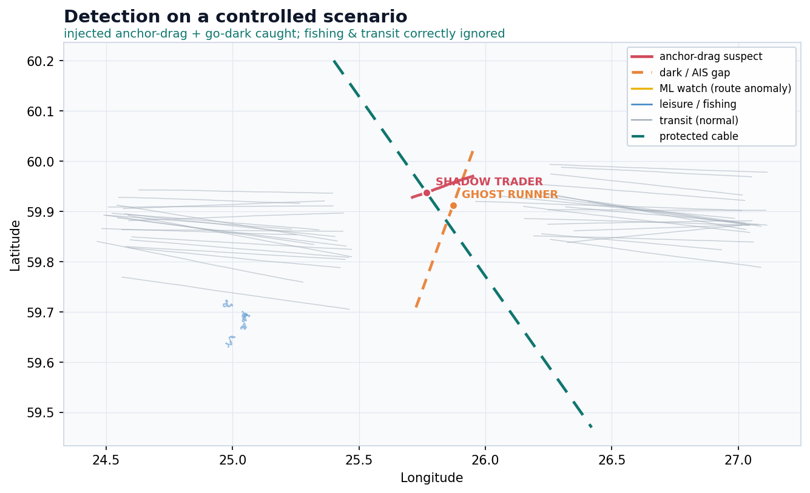
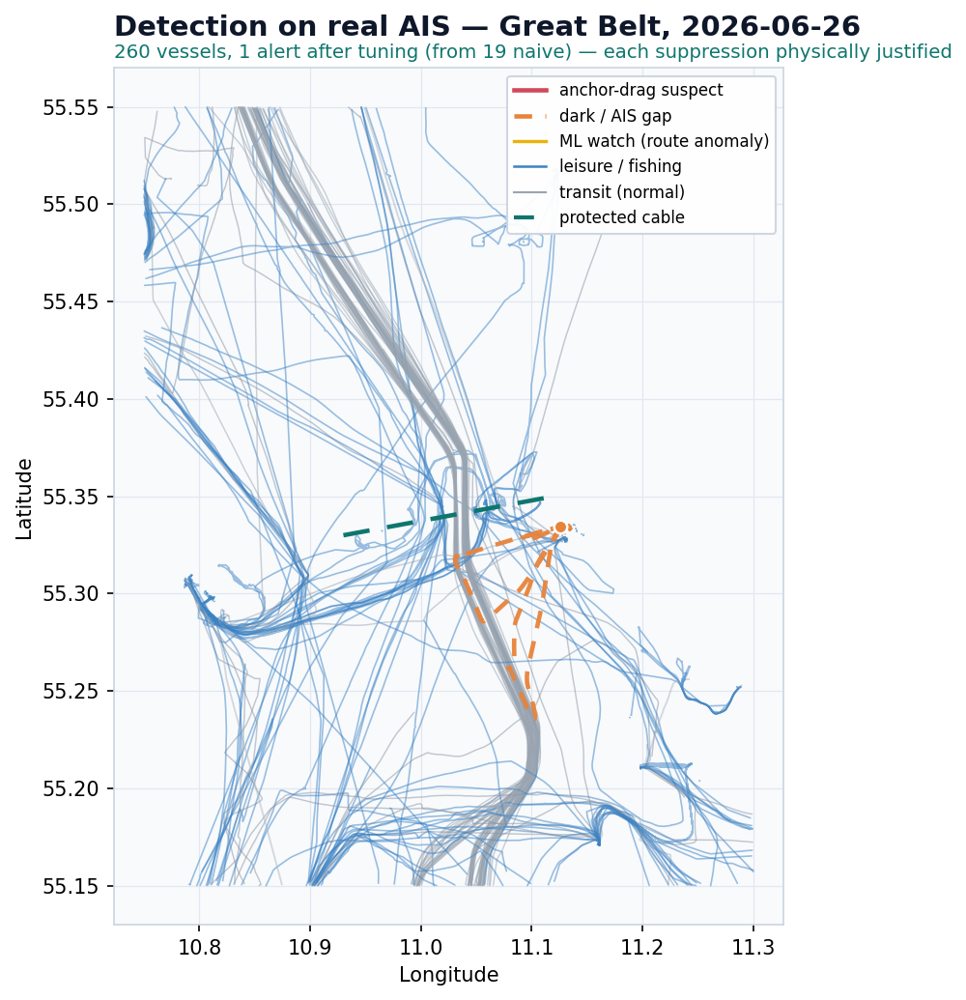
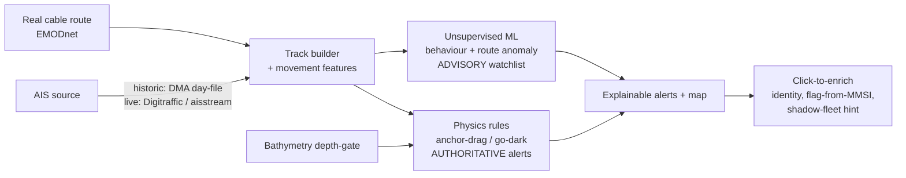

# Seabed Sentinel

**Sovereign, explainable detection of threats to undersea cables & pipelines — from public AIS.**

Learns what normal vessel traffic looks like around a protected cable and flags the two
behaviours that precede a cable cut — a vessel **dragging an anchor** slowly across the route,
and a vessel **going dark** (AIS off) over it — on an interactive map, with an explainable
reason for every alert. Runs in **historic** (replay a day) and **live** (streaming) modes, on
free European/national data only.



*Controlled scenario: an injected anchor-drag (red) and a go-dark vessel (orange) are caught
crossing the cable, while transit traffic (grey) and slow, erratic fishing boats (blue) are
correctly ignored — the hard false-positive case.*

---

## Why

Undersea cables and pipelines carry Europe's power, data and gas, and deliberate attacks on them
are escalating — Balticconnector (Oct 2023), C-Lion1 & BCS East-West (Nov 2024), Estlink 2
(Dec 2024). Europe is responding with real money and mandate (EU submarine-cable security
funding, NATO Baltic Sentry), but needs **sovereign, explainable** monitoring it doesn't have to
buy from foreign vendors. Seabed Sentinel is a proof of concept for that layer.

## Results on real data

| | |
|---|---|
| **Live** | Monitors the free Finnish Digitraffic feed over the Gulf of Finland — the real incident corridor — with no API key. |
| **19 → 1** | False alerts on a real Danish Maritime Authority AIS day (2026-06-26, Great Belt), after physically-motivated tuning. Each suppression is justified, not a threshold hack. |
| **100% explainable** | Every alert carries the exact factors that triggered it (speed band, heading-vs-course, corridor crossing, depth, AIS gap). |



## How it works



Three layers, deliberately separated:

- **Physics rules** are the authoritative alert layer — interpretable and defensible (a defence
  buyer needs the *why*, not a black box). Slow sustained travel in the anchor-drag speed band,
  heading-vs-course mismatch (a dragged hull crabs off its track), crossing the cable corridor,
  and AIS gaps over it — no single factor alerts, the rare *conjunction* does.
- **Unsupervised ML** ranks the gray zone: a **portable behaviour model** (Isolation Forest on
  place-independent motion features, trained once, transfers to any spot) plus a **per-spot,
  self-calibrating route model** (learns each waterway's normal lanes from its own traffic).
- **Physical gates**: vessel type/size and a **bathymetry depth-gate** reject the physically
  impossible (a sailboat can't cut an HVDC cable; you can't drag an anchor to a seabed you can't
  reach).

## Quickstart

```bash
pip install -r requirements.txt

python run.py                       # self-test on the bundled sample -> demo_map.html + alerts.csv
python run_real.py aisdk-YYYY-MM-DD.csv   # a real DMA day-file (streamed + bbox-filtered)
python app.py                       # interactive app: historic + live modes, click-to-enrich
                                    # -> http://127.0.0.1:5000  (pick the corridor from the dropdown)
```

Train the models (optional; the system runs rules-only without them):

```bash
python train_behavior.py data/real_bbox.csv [more days / spots ...]   # global behaviour model
python build_route.py    great_belt data/real_bbox.csv                # per-spot route model
```

## Repository layout

```
seabed.py         detector: AIS -> tracks -> features -> classify -> explainable alerts
model.py          BehaviorModel (global) + RouteModel (per-spot, self-calibrating)
spots.py          registry of monitored waterways (cable route + corridor + bbox)
geo_layers.py     real cable routes (EMODnet) + bathymetry depth sampling
enrich.py         vessel enrichment: flag-from-MMSI, shadow-fleet hint, registry links
live_sources.py   live AIS connectors (Digitraffic MQTT, aisstream WS)
app.py            Flask + Leaflet app (historic + live + click-to-enrich)
run.py / run_real.py / train_*.py / build_route.py / import_cable.py / gfw_pull.py
```

## Data sources (all European / sovereign)

Finnish **Digitraffic** (live, no key) · Danish **DMA** open AIS (historic) · **EMODnet**
(cable routes + bathymetry) · **Global Fishing Watch** (vessel identity/events). No dependency
on US or other foreign providers — the sovereignty claim is structural, not marketing.

## Design decisions

- **Unsupervised, not supervised.** Cable-sabotage events are far too rare to train a classifier
  that generalises; there are no labels. So the system models *normal* (abundant) and scores
  deviation.
- **Rules authoritative, ML advisory.** ML "unusual" ≠ "suspicious" (raw anomaly detection
  surfaces big ferries). Keeping interpretable rules in charge is what makes alerts trustworthy.
- **Portable behaviour + per-spot routes.** Behaviour transfers across waterways; lanes don't —
  so each spot self-calibrates its own route model, and a new spot needs no labels, just data.
- **Physically-motivated tuning.** The 19→1 false-positive reduction came from *physics*
  (vessel size, water depth, under-way requirement), not from turning a knob down.

## Honest limitations & roadmap

This is a proof of concept, not an operational product. Free AIS can't replay historical incident
tracks (the Gulf-of-Finland incidents are outside free coverage), a single day is not a validated
false-positive rate, and satellite-radar revisit is intermittent. Path to operational: a
design-partner's operational feed, a multi-day false-positive baseline, and **Phase 2** — fusing
Sentinel-1 SAR dark-vessel detections with the AIS go-dark events (catching vessels that turn
themselves invisible).

**See [ROADMAP.md](ROADMAP.md)** for the full outlook and next steps — SAR cross-check, real cable
routes & bathymetry, the large-scale movement-model training run, and the path to operational.

---

*Author: Hannes Zimmermann & Claude*
